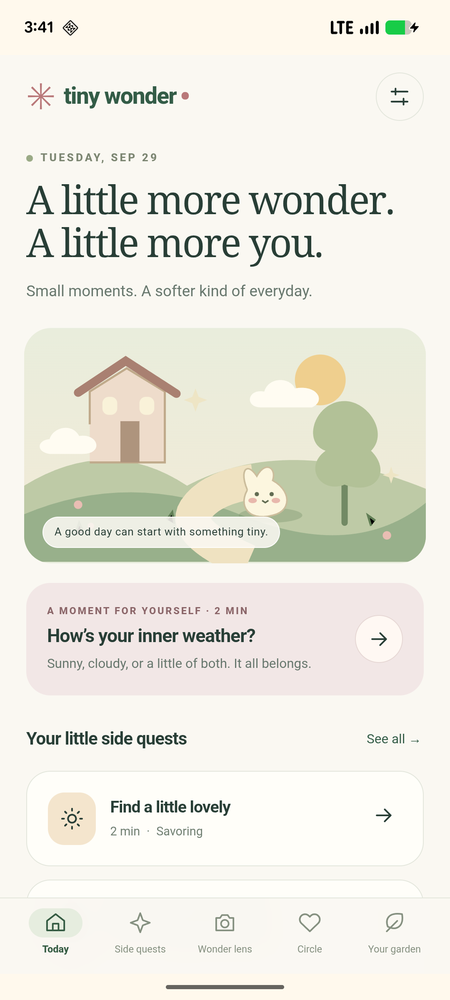

# RomantiSide

**Tiny Wonder** is the working product name for this Android-only startup demonstration: brief check-ins, optional positive-psychology side quests delivered through notifications, a playful live camera, and a private friends ranking.

The initial audience is adult students and early-career professionals who want one doable next step when their day feels flat. This repository includes the implementation and a sourced investor/product research package. It has no verified commercial traction or efficacy results.

## Try the demonstration

Install [the debug Android APK](artifacts/romantiside-demo.apk) on Android 8 or newer. Android may ask you to allow installation from the application opening the file. This is a developer-signed demonstration, not a Play Store release.

1. Open **Tiny Wonder** and make a check-in. Choose mood and energy, then type or use Android voice transcription. Confirm the result yourself.
2. Open a suggested side quest. Try the activity, mark it complete, and optionally rate whether it helped.
3. Open **Settings**, enable reminders, choose hours, and allow Android notification permission. Use the test buttons to try a quest or check-in notification. Quest actions and text replies work without opening the app.
4. Open **Wonder lens**. Allow the camera to try live pastel effects and illustrated stickers; save a moment to your local garden. An explicitly labelled illustration preview works without camera access.
5. Open **Circle** for the optional private ranking. The sample preview is labelled as fictional. Real counts require the companion service below and friends who opt in and exchange codes.



[View the Circle ranking screenshot](artifacts/demo-ranking.png) (explicitly fictional sample data).

## What is implemented

| Feature | Demonstration behavior |
|---|---|
| Daily check-in | Local text reflection, five-point self-rated mood, three-point energy, optional Android speech transcription for up to two minutes. Speech may end at a pause. |
| Automatic delivery | Opt-in daily check-in and side quest, configurable hours, 9 pm–8 am quiet hours, reboot/time-zone restoration, inexact Android alarms. |
| Notification actions | Full quest instruction plus Done, 30 minutes later, and Skip. Check-ins accept inline text replies. Unrated replies remain unconfirmed until the user chooses ratings. |
| Side quests | Eight activities adapted from savoring, gratitude, strengths, self-compassion, connection, and optimism research. Recent confirmed mood and energy guide both app and notification choices. |
| Wonder Lens | Live camera color treatments and procedural kawaii-inspired stickers. Three palettes, local captures, last five snapshots retained. No face analysis or generative scene transformation. |
| Personal garden | Real local completion counts, confirmed mood trends, reflections, and snapshots. Empty states contain no fabricated personal history. |
| Contact friends ranking | Explicit opt-in, native single-contact picker for a local label, private friend-code connections, completed-quest ranking over the last seven days or all time. Ties share a rank. |
| Privacy controls | Core experience works without an account. Local deletion, optional camera/microphone/reminder permissions, backup exclusion, no analytics or advertising SDKs. Separate Circle deletion removes shared profile, counts, and relationships. |

## What remains a proposal

There is no production LLM, diagnostic mood inference, autonomous telephone call, SMS gateway, generative camera model, clinical assessment, or proven improvement in happiness. The app clearly labels its text guess as a simple rule; the user's ratings control recommendations. Voice is Android transcription, not a conversational therapist. The camera filters run on the device. Reviewed prompt retrieval, richer voice conversations, optional computer vision for broad scene context, and adaptive recommendation models are covered in the research.

Circle is a working development service, not an externally deployed production backend. It uses pseudonymous bearer accounts and private codes; code possession establishes a mutual connection, not verified phone-number identity. There is no bulk address-book lookup. Counts are self-reported client events and are not cheat-proof. Counts update when each person opens or refreshes Circle; notification completions remain local until that sync. A production launch needs HTTPS hosting, stronger account recovery/invitation controls, operational security, abuse prevention, and a reviewed privacy policy.

## Research and investor materials

- [Investor and product brief](research/investor-brief.md): competitor matrix, differentiated proposition, product expansion, AI/ML architecture, go-to-market, illustrative economics, investor objections, and a 60-second pitch.
- [Positive psychology and measurement](research/psychology.md): source-linked activity matrix, evidence limits, check-in design, camera rationale, outcome measures, and feasibility/randomized study plans.
- [Social ranking product decision](research/social-ranking.md): consent model, implementation, and a proposed test of whether rankings help or discourage use.

The strongest positioning to test is **one relevant real-world action that arrives when it is useful**. Cute design and AI check-ins alone are already offered by competitors. The proposed exercises are adaptations of research; the exact app, duration, and delivery combination are untested. Changes in self-reported mood do not establish causation. Financial figures in the brief are explicit scenarios, not market estimates or forecasts.

## Build

Prerequisites: JDK 17, Android SDK platform 35 and build tools, `ANDROID_HOME` or an Android Studio `local.properties`. The Gradle wrapper downloads Gradle 8.13 if needed. Android Studio can open the `android` folder directly.

Windows:

```powershell
cd android
.\gradlew.bat :app:assembleDebug :app:lintDebug
```

macOS/Linux:

```sh
cd android
./gradlew :app:assembleDebug :app:lintDebug
```

The APK is generated at `android/app/build/outputs/apk/debug/app-debug.apk`. No AI API key, npm build, or web server is needed for the offline Android features. The UI is packaged local HTML/CSS/JavaScript in a native Java host. Native Android owns permissions, speech, alarms, notification actions, the contact picker, and Circle networking. External web content cannot enter the privileged WebView.

## Run real Circle rankings locally

Use Node 24 or later. In a terminal from the repository root:

```sh
node server/server.mjs
```

For each attached Android device running the debug APK:

```sh
adb reverse tcp:8787 tcp:8787
```

Open Circle, choose your own display name, and exchange private codes manually with another participant. Each friend needs the app connected to the same service and must choose to join. The debug APK uses loopback via ADB reverse; only loopback cleartext is allowed in debug. The release resource leaves the service URL unset until an HTTPS deployment is configured. See [the server instructions](server/README.md) for its API, persistence, and limitations. Server data is excluded from Git.

## Verify

```sh
node --test tests/logic.test.cjs
node --test server/server.test.mjs
```

Native integration tests use the Android framework directly, without a third-party test runner:

```powershell
cd android
.\gradlew.bat :app:assembleDebug :app:assembleDebugAndroidTest
adb install -r app/build/outputs/apk/debug/app-debug.apk
adb install -r app/build/outputs/apk/androidTest/debug/app-debug-androidTest.apk
adb shell am instrument -w com.tinywonder.app.test/com.tinywonder.app.SmokeTestRunner
```

The native runner preserves and restores original local app state and reminder scheduling. It exercises the receiver and storage behavior using synthetic data. Notification posting is skipped if system permission is denied or quiet hours are active. UI smoke tests use synthetic reflections only. Tests must not be used to infer clinical effectiveness.

With the local Circle server running and ADB reverse configured, add `-e circle true` before the test component to exercise real native HTTP join, sync, friend ranking, and deletion. Those tests clean up their synthetic profiles and restore the original Circle credentials.

Verified on September 29, 2026: **17 Android integration checks passed**, including the optional Circle checks; **6 app-logic tests and 5 server tests passed**. APK build and Android lint succeeded. See [validation details](tests/VALIDATION.md) for scope and remaining manual checks.

For optional source formatting, run `npm ci` and `npm run format`. The packaged app needs no npm runtime dependencies.

## Known limits

- Android may delay alarms during battery restrictions. Force-stopping an app prevents reminders until it is reopened; permission or channel denial also prevents delivery.
- The Android speech provider may process audio remotely. The app asks before voice use and stores only confirmed text; provider behavior is outside the app's local storage guarantee.
- SharedPreferences stores local reflections and small photos in app-private storage, not an application-level encrypted database. Do not use this prototype for highly sensitive records.
- The app targets API 35 and was exercised on a Pixel 6a running API 36. Wider device, screen-reader, offline speech, and long-duration battery tests remain before release.
- Friend codes should be shared privately. A contact label is not evidence that an account belongs to that person. Do not present the ranking as a mental-health or wellbeing score.
